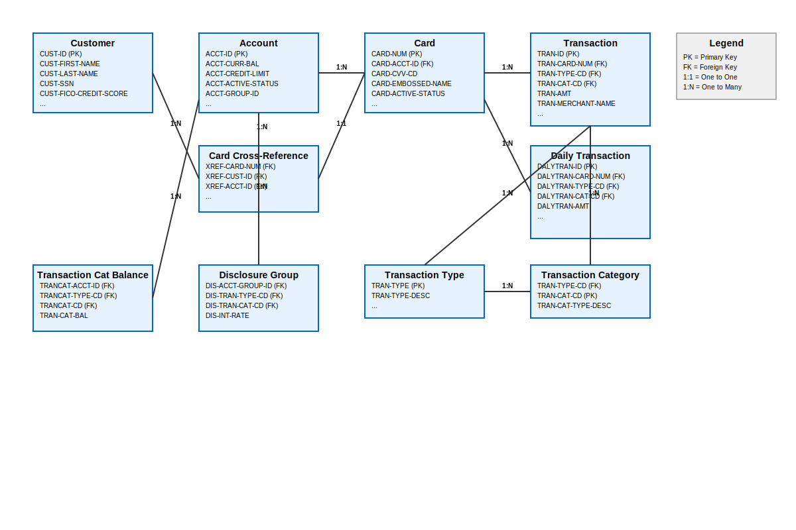

# Business Entities Extracted from COBOL Legacy System

This document contains the business entities extracted from the CardDemo COBOL legacy system, focusing on real-world, business-relevant data structures essential for domain modeling and modernization.

## Business Entities Overview

The following 10 core business entities have been identified from the COBOL copybooks and programs:

1. **Customer** - Core customer information and demographics
2. **Account** - Financial account details and balances
3. **Card** - Credit/debit card information
4. **Card Cross-Reference** - Relationship mapping between cards, customers, and accounts
5. **Transaction** - Individual transaction records
6. **Daily Transaction** - Daily transaction processing records
7. **Transaction Category Balance** - Account balances by transaction category
8. **Disclosure Group** - Interest rate and disclosure information by account group
9. **Transaction Type** - Transaction type definitions and descriptions
10. **Transaction Category** - Transaction category definitions and descriptions

---

## Detailed Entity Definitions

### 1. Customer Entity
**Source:** CUSTREC.cpy, CVCUS01Y.cpy  
**Record Length:** 500 bytes

| Attribute | Data Type | Description |
|-----------|-----------|-------------|
| CUST-ID | PIC 9(09) | Unique customer identifier |
| CUST-FIRST-NAME | PIC X(25) | Customer first name |
| CUST-MIDDLE-NAME | PIC X(25) | Customer middle name |
| CUST-LAST-NAME | PIC X(25) | Customer last name |
| CUST-ADDR-LINE-1 | PIC X(50) | Primary address line |
| CUST-ADDR-LINE-2 | PIC X(50) | Secondary address line |
| CUST-ADDR-LINE-3 | PIC X(50) | Tertiary address line |
| CUST-ADDR-STATE-CD | PIC X(02) | State code |
| CUST-ADDR-COUNTRY-CD | PIC X(03) | Country code |
| CUST-ADDR-ZIP | PIC X(10) | ZIP/postal code |
| CUST-PHONE-NUM-1 | PIC X(15) | Primary phone number |
| CUST-PHONE-NUM-2 | PIC X(15) | Secondary phone number |
| CUST-SSN | PIC 9(09) | Social Security Number |
| CUST-GOVT-ISSUED-ID | PIC X(20) | Government issued ID |
| CUST-DOB-YYYY-MM-DD | PIC X(10) | Date of birth |
| CUST-EFT-ACCOUNT-ID | PIC X(10) | Electronic funds transfer account ID |
| CUST-PRI-CARD-HOLDER-IND | PIC X(01) | Primary card holder indicator |
| CUST-FICO-CREDIT-SCORE | PIC 9(03) | FICO credit score |

### 2. Account Entity
**Source:** CVACT01Y.cpy  
**Record Length:** 300 bytes

| Attribute | Data Type | Description |
|-----------|-----------|-------------|
| ACCT-ID | PIC 9(11) | Unique account identifier |
| ACCT-ACTIVE-STATUS | PIC X(01) | Account active status flag |
| ACCT-CURR-BAL | PIC S9(10)V99 | Current account balance |
| ACCT-CREDIT-LIMIT | PIC S9(10)V99 | Credit limit amount |
| ACCT-CASH-CREDIT-LIMIT | PIC S9(10)V99 | Cash advance credit limit |
| ACCT-OPEN-DATE | PIC X(10) | Account opening date |
| ACCT-EXPIRAION-DATE | PIC X(10) | Account expiration date |
| ACCT-REISSUE-DATE | PIC X(10) | Account reissue date |
| ACCT-CURR-CYC-CREDIT | PIC S9(10)V99 | Current cycle credit amount |
| ACCT-CURR-CYC-DEBIT | PIC S9(10)V99 | Current cycle debit amount |
| ACCT-ADDR-ZIP | PIC X(10) | Account address ZIP code |
| ACCT-GROUP-ID | PIC X(10) | Account group identifier |

### 3. Card Entity
**Source:** CVACT02Y.cpy  
**Record Length:** 150 bytes

| Attribute | Data Type | Description |
|-----------|-----------|-------------|
| CARD-NUM | PIC X(16) | Unique card number |
| CARD-ACCT-ID | PIC 9(11) | Associated account identifier |
| CARD-CVV-CD | PIC 9(03) | Card verification value code |
| CARD-EMBOSSED-NAME | PIC X(50) | Name embossed on card |
| CARD-EXPIRAION-DATE | PIC X(10) | Card expiration date |
| CARD-ACTIVE-STATUS | PIC X(01) | Card active status flag |

### 4. Card Cross-Reference Entity
**Source:** CVACT03Y.cpy  
**Record Length:** 50 bytes

| Attribute | Data Type | Description |
|-----------|-----------|-------------|
| XREF-CARD-NUM | PIC X(16) | Card number reference |
| XREF-CUST-ID | PIC 9(09) | Customer identifier reference |
| XREF-ACCT-ID | PIC 9(11) | Account identifier reference |

### 5. Transaction Entity
**Source:** CVTRA05Y.cpy  
**Record Length:** 350 bytes

| Attribute | Data Type | Description |
|-----------|-----------|-------------|
| TRAN-ID | PIC X(16) | Unique transaction identifier |
| TRAN-TYPE-CD | PIC X(02) | Transaction type code |
| TRAN-CAT-CD | PIC 9(04) | Transaction category code |
| TRAN-SOURCE | PIC X(10) | Transaction source |
| TRAN-DESC | PIC X(100) | Transaction description |
| TRAN-AMT | PIC S9(09)V99 | Transaction amount |
| TRAN-MERCHANT-ID | PIC 9(09) | Merchant identifier |
| TRAN-MERCHANT-NAME | PIC X(50) | Merchant name |
| TRAN-MERCHANT-CITY | PIC X(50) | Merchant city |
| TRAN-MERCHANT-ZIP | PIC X(10) | Merchant ZIP code |
| TRAN-CARD-NUM | PIC X(16) | Associated card number |
| TRAN-ORIG-TS | PIC X(26) | Original timestamp |
| TRAN-PROC-TS | PIC X(26) | Processing timestamp |

### 6. Daily Transaction Entity
**Source:** CVTRA06Y.cpy  
**Record Length:** 350 bytes

| Attribute | Data Type | Description |
|-----------|-----------|-------------|
| DALYTRAN-ID | PIC X(16) | Unique daily transaction identifier |
| DALYTRAN-TYPE-CD | PIC X(02) | Transaction type code |
| DALYTRAN-CAT-CD | PIC 9(04) | Transaction category code |
| DALYTRAN-SOURCE | PIC X(10) | Transaction source |
| DALYTRAN-DESC | PIC X(100) | Transaction description |
| DALYTRAN-AMT | PIC S9(09)V99 | Transaction amount |
| DALYTRAN-MERCHANT-ID | PIC 9(09) | Merchant identifier |
| DALYTRAN-MERCHANT-NAME | PIC X(50) | Merchant name |
| DALYTRAN-MERCHANT-CITY | PIC X(50) | Merchant city |
| DALYTRAN-MERCHANT-ZIP | PIC X(10) | Merchant ZIP code |
| DALYTRAN-CARD-NUM | PIC X(16) | Associated card number |
| DALYTRAN-ORIG-TS | PIC X(26) | Original timestamp |
| DALYTRAN-PROC-TS | PIC X(26) | Processing timestamp |

### 7. Transaction Category Balance Entity
**Source:** CVTRA01Y.cpy  
**Record Length:** 50 bytes

| Attribute | Data Type | Description |
|-----------|-----------|-------------|
| TRANCAT-ACCT-ID | PIC 9(11) | Account identifier |
| TRANCAT-TYPE-CD | PIC X(02) | Transaction type code |
| TRANCAT-CD | PIC 9(04) | Transaction category code |
| TRAN-CAT-BAL | PIC S9(09)V99 | Category balance amount |

### 8. Disclosure Group Entity
**Source:** CVTRA02Y.cpy  
**Record Length:** 50 bytes

| Attribute | Data Type | Description |
|-----------|-----------|-------------|
| DIS-ACCT-GROUP-ID | PIC X(10) | Account group identifier |
| DIS-TRAN-TYPE-CD | PIC X(02) | Transaction type code |
| DIS-TRAN-CAT-CD | PIC 9(04) | Transaction category code |
| DIS-INT-RATE | PIC S9(04)V99 | Interest rate |

### 9. Transaction Type Entity
**Source:** CVTRA03Y.cpy  
**Record Length:** 60 bytes

| Attribute | Data Type | Description |
|-----------|-----------|-------------|
| TRAN-TYPE | PIC X(02) | Transaction type code |
| TRAN-TYPE-DESC | PIC X(50) | Transaction type description |

### 10. Transaction Category Entity
**Source:** CVTRA04Y.cpy  
**Record Length:** 60 bytes

| Attribute | Data Type | Description |
|-----------|-----------|-------------|
| TRAN-TYPE-CD | PIC X(02) | Transaction type code |
| TRAN-CAT-CD | PIC 9(04) | Transaction category code |
| TRAN-CAT-TYPE-DESC | PIC X(50) | Transaction category description |

---

## Entity Relationships

### Primary Relationships

1. **Customer ↔ Card Cross-Reference** (1:N)
   - One customer can have multiple card cross-references
   - Foreign Key: CUST-ID

2. **Account ↔ Card Cross-Reference** (1:N)
   - One account can have multiple card cross-references
   - Foreign Key: ACCT-ID

3. **Card ↔ Card Cross-Reference** (1:1)
   - Each card has one cross-reference entry
   - Foreign Key: CARD-NUM

4. **Card ↔ Account** (N:1)
   - Multiple cards can belong to one account
   - Foreign Key: CARD-ACCT-ID → ACCT-ID

5. **Card ↔ Transaction** (1:N)
   - One card can have multiple transactions
   - Foreign Key: CARD-NUM

6. **Card ↔ Daily Transaction** (1:N)
   - One card can have multiple daily transactions
   - Foreign Key: CARD-NUM

7. **Account ↔ Transaction Category Balance** (1:N)
   - One account can have multiple category balances
   - Foreign Key: ACCT-ID

8. **Transaction Type ↔ Transaction Category** (1:N)
   - One transaction type can have multiple categories
   - Foreign Key: TRAN-TYPE-CD

9. **Transaction Type ↔ Transaction** (1:N)
   - One transaction type can have multiple transactions
   - Foreign Key: TRAN-TYPE-CD

10. **Transaction Category ↔ Transaction** (1:N)
    - One transaction category can have multiple transactions
    - Foreign Key: TRAN-CAT-CD

11. **Account Group ↔ Disclosure Group** (1:N)
    - One account group can have multiple disclosure entries
    - Foreign Key: ACCT-GROUP-ID → DIS-ACCT-GROUP-ID

### Relationship Summary

- **Customer** is the root entity connected to cards through Card Cross-Reference
- **Account** manages financial data and connects to cards and transaction balances
- **Card** serves as the transaction instrument linking customers to their transactions
- **Transaction entities** (Transaction, Daily Transaction) capture all financial activity
- **Reference entities** (Transaction Type, Transaction Category) provide classification
- **Balance entities** (Transaction Category Balance, Disclosure Group) manage financial rules and balances

---

## Entity Relationship Diagram

The diagram above shows the complete relationship structure between all business entities, including cardinality indicators and foreign key relationships.

---

## Notes

- All FILLER fields and technical variables (WS-, TEMP-, FLAGS) have been excluded from this analysis
- Only business-relevant attributes essential for domain modeling are included
- Record lengths are provided for reference but may include FILLER space not documented here
- Date fields use various formats (YYYY-MM-DD, YYYYMMDD) as defined in the original COBOL structures
- Monetary amounts use COBOL packed decimal format (S9(n)V99) for precision
